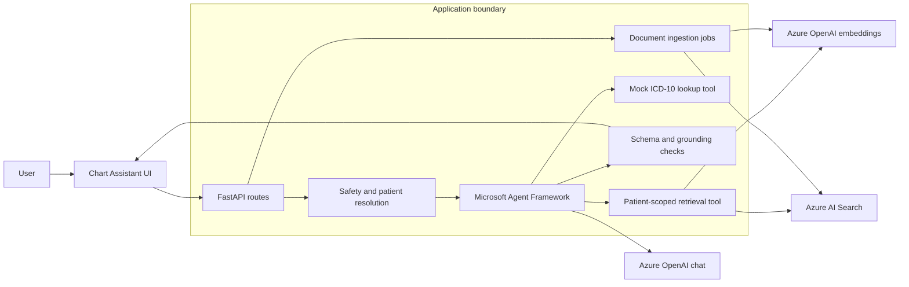
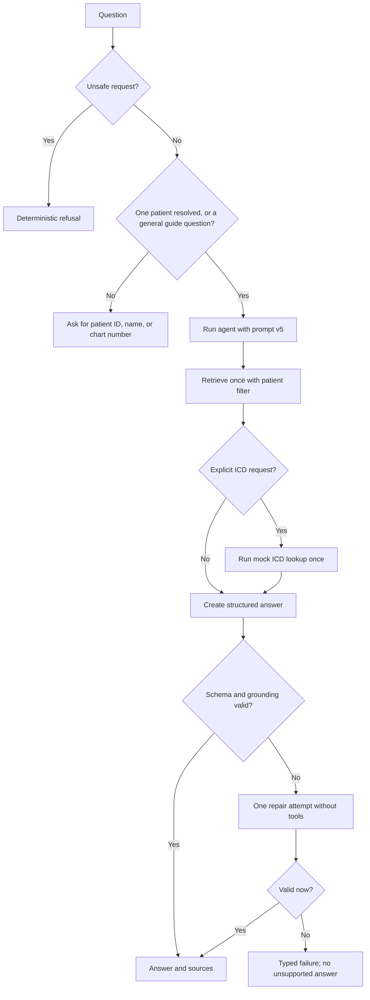

# Chart Assistant

Chart Assistant is a grounded question-answering system for synthetic patient charts. A user can
mention a patient naturally, ask about diagnoses, medications, visits, or coding, and get an answer
that is limited to that patient's documents with the exact chart sources shown beside it.

**Release v1.0.1 · [Open the live application](https://chart-assistant.vercel.app)**

This is my solution for the RAAPID Applied AI Engineer take-home assignment. I treated the task as
more than a prompt demo: the project includes ingestion, patient-safe retrieval, tool calling,
schema validation, failure handling, evaluations, health checks, and a small interface that an
interviewer can use without knowing the backend.

[Try the live system](https://chart-assistant.vercel.app) ·
[Architecture](docs/architecture.md) · [Changelog](CHANGELOG.md)

> The repository and hosted application use fictional data only. They are not intended for real
> clinical, coding, billing, or coverage decisions.

## The problem I was solving

The assignment asked for a GenAI service that could ingest mock clinical and policy documents,
retrieve the right chunks, answer only from those chunks, call an external tool, and return
schema-validated JSON. It also needed to show how the system behaves when retrieval is weak, model
output is malformed, a tool fails, or a healthcare question needs human review.

My main design choice was to make the patient boundary part of the retrieval logic instead of
leaving it to the prompt. Before search begins, the application resolves one patient from the
question. If the reference is missing or ambiguous, it asks for clarification and never searches
across several patient charts.

## Try it live

The current build is running at **[chart-assistant.vercel.app](https://chart-assistant.vercel.app)**.
The header includes a system-status control that checks Azure OpenAI and Azure AI Search, so a
service problem is visible before a question is submitted.

Good questions to try:

1. `What kidney condition is documented for patient 4?`
2. `What ICD code is supported for patient 4's documented CKD stage 3b?`
3. `Does patient 3 have diabetes, or is it family history only?`
4. `Summarize the recent visits.` — this intentionally asks for a patient reference before search.

The first question was also used as a post-deployment check. It resolved `patient 4` to `SYN-P004`,
retrieved from Azure AI Search, and returned a cited chart answer through the v5 system prompt.

## What the application does

- Resolves patient IDs, names, chart references, and shortcuts such as `patient 4`.
- Retrieves keyword and vector matches through Azure AI Search with an exact patient filter.
- Uses Microsoft Agent Framework for bounded retrieval and mock ICD-10 tool calls.
- Returns a strict Pydantic response with answer status, citations, confidence, and missing details.
- Checks every source quote against the retrieved chunk before returning the answer.
- Gives malformed model output one repair attempt, then fails safely if it is still invalid.
- Shows answer details, tool activity, and trace information without crowding the normal interface.
- Accepts new synthetic charts and shows real upload, parsing, chunking, embedding, and indexing
  progress.

## Supported chart files

| File type | What is preserved | Clear failure behavior |
|---|---|---|
| PDF | Extractable text and page numbers | Encrypted and image-only PDFs are rejected because OCR is outside this demo |
| DOCX | Headings and paragraphs | Empty documents are rejected |
| Markdown | Headings and text sections | Empty documents are rejected |
| TXT | Paragraphs and structured assignment metadata when present | Invalid or mismatched embedded patient metadata is rejected |

Ordinary files do not need custom metadata. The user enters a patient or chart reference during
upload. Structured assignment documents are still supported, and their embedded patient reference
must match the entered value. The current limits are 25 files, 5 MiB per file, and 25 MiB total per
request. Stable document IDs and content hashes make repeat ingestion idempotent.

## How I approached reliability

I started with a basic zero-shot prompt. It worked for easy questions but could be vague about tool
use, missing information, and the exact output shape. I improved it in small steps until v5 made the
retrieval boundary, tool limits, citations, refusal rules, and JSON contract explicit. The complete
progression is kept in `backend/prompts/` and explained in the
[prompting notes](docs/strategies/prompting.txt).

I took the same practical approach to chunking. Very small chunks lost context and very large chunks
added noise. The current 180-token target, 240-token maximum, and 30-token overlap were the middle
ground for these short charts. Pages and headings are preserved before token limits are applied. See
the [chunking notes](docs/strategies/chunking.txt) for the short dev log.

Production-shaped failure cases are built into the flow:

- Missing or ambiguous patient context stops before retrieval.
- Empty retrieval returns a supported refusal instead of a guess.
- Unsupported citations or tool codes fail grounding validation.
- Malformed structured output gets one bounded repair attempt.
- Missing Azure configuration returns a typed `503` with a request ID.
- Azure requests, retries, ingestion stages, and validation failures use structured logs.

## Why I chose this stack

- **Microsoft Agent Framework** gave me a real tool-calling loop while keeping retrieval and the ICD
  lookup as normal Python functions that are easy to test.
- **Azure OpenAI** supplied chat generation and embeddings through resources I could use for a real
  hosted demo instead of stopping at a mocked notebook.
- **Azure AI Search** put keyword, vector, and semantic retrieval together with exact patient and
  source-role filters in one managed index.
- **FastAPI and Pydantic** made the HTTP contract, structured response, validation, and typed errors
  easy to inspect.
- **Vercel and GitHub Actions** provide repeatable preview builds, deployment health checks, and a
  simple live endpoint for review.

## Architecture





More detail is available in the [architecture note](docs/architecture.md),
[RAG flow](docs/flows/rag-flow.md), and [ingestion flow](docs/flows/ingestion-flow.md).

## Run it locally

### Prerequisites

- Python 3.11 or newer
- An Azure OpenAI resource with chat and embedding deployments
- An Azure AI Search service and index

### Required credentials

Copy `.env.example` to `.env` and replace the placeholders. `.env` is ignored by Git.

| Variable | Purpose |
|---|---|
| `AZURE_OPENAI_ENDPOINT` | Azure OpenAI resource endpoint |
| `AZURE_OPENAI_API_KEY` | Azure OpenAI API key |
| `AZURE_OPENAI_API_VERSION` | API version; the example uses `2024-10-21` |
| `AZURE_OPENAI_CHAT_DEPLOYMENT` | Deployed chat-model name |
| `AZURE_OPENAI_EMBEDDING_DEPLOYMENT` | Deployed embedding-model name |
| `AZURE_SEARCH_ENDPOINT` | Azure AI Search endpoint |
| `AZURE_SEARCH_QUERY_KEY` | Query-only key used by the answering path |
| `AZURE_SEARCH_ADMIN_KEY` | Admin key used only to create/update the index during ingestion |
| `AZURE_SEARCH_INDEX_NAME` | Existing index name; new installations default to `healthchat-documents-v1` |

The `RAG_*` values in `.env.example` are optional tuning controls and already have safe defaults.

### Install and start

```bash
git clone https://github.com/hritthik-work/HealthBot.git
cd HealthBot
python3 -m venv .venv
source .venv/bin/activate
python -m pip install --upgrade pip
python -m pip install -e '.[dev]'
cp .env.example .env
# Fill in the Azure values in .env before continuing.
uvicorn backend.main:app --reload
```

Open:

- Application: `http://127.0.0.1:8000`
- OpenAPI documentation: `http://127.0.0.1:8000/docs`
- Live dependency health: `http://127.0.0.1:8000/health/services?deep=true`

### Load the sample knowledge base

The repository contains 25 fictional notes, guides, and policies across five synthetic patients.
With the server running, ingest them from a second `zsh` terminal:

```bash
form_args=()
for source_file in data/synthetic-charts/DOC-*.txt; do
  form_args+=(--form "files=@${source_file};type=text/plain")
done
curl --fail-with-body --request POST "http://127.0.0.1:8000/ingestion" "${form_args[@]}"
```

Repeating this command is safe; unchanged chunks are not embedded or indexed again.

## Verification

```bash
.venv/bin/python -m ruff check .
.venv/bin/python -m pytest -q
.venv/bin/python -m evals.run_evals
```

Current result: **63 tests passed** and **12/12 deterministic retrieval evaluations passed**. The
suite covers all four parsers, idempotent ingestion, progress jobs, patient resolution, cross-patient
isolation, retrieval filters, prompt versions, tool behavior, grounding, repairs, API failures, and
evaluator-style flows. The deployment pipeline separately checks the real Azure services.

## API surface

| Method | Endpoint | Purpose |
|---|---|---|
| `POST` | `/query` | Ask a grounded patient-chart question |
| `POST` | `/ingestion` | Synchronous ingestion for CLI compatibility |
| `POST` | `/ingestion/jobs` | Upload charts and start a progress job |
| `GET` | `/ingestion/jobs/{job_id}` | Poll real ingestion stages and the final result |
| `GET` | `/documents` | List normalized documents |
| `GET` | `/health` | Read application version, configuration, and counts |
| `GET` | `/health/services?deep=true` | Test Azure chat, embeddings, search, and ingestion access |

## Known limitations

- This is a synthetic-data take-home demo, not a PHI-ready application.
- There is no identity, authorization, tenant isolation, or durable audit store.
- Scanned and image-only PDFs need an OCR service before ingestion.
- The ICD-10 tool is deliberately mocked to demonstrate bounded tool calling.
- Vercel can recycle instances, so the in-memory ingestion-job registry and local normalized
  artifacts are not durable. Azure AI Search updates persist, but production ingestion should move
  job state and processing to shared storage plus a queue or workflow.
- Uploaded files are not malware-scanned, and retention/deletion administration is outside scope.
- Before real charts, I would add PHI-safe telemetry, managed identity, access controls, durable job
  state, malware scanning, retention policies, clinical review, and compliance approval.

These limits are intentional and visible. The application fails clearly when it reaches one instead
of presenting the demo as a finished clinical product.

## Repository guide

```text
api/                       thin Vercel ASGI adapter
backend/api/routes/        query, ingestion, document, and health endpoints
backend/core/              settings, typed errors, and structured diagnostics
backend/services/          ingestion, retrieval, agent, grounding, tools, and Azure clients
backend/prompts/           five system-prompt versions and one repair prompt
frontend/                  minimal answer-first UI and static assets
data/synthetic-charts/     25 fictional notes, guides, and policies
docs/                      architecture, flows, strategies, deployment, and assignment context
evals/                     deterministic retrieval cases and runner
tests/                     unit, integration, API, and evaluator-style tests
```

## Release and deployment

GitHub Actions validates pull requests, builds a Python wheel, and runs the retrieval evaluations.
The Vercel preview workflow builds one immutable artifact, deploys it, checks the public page, and
then calls every live Azure dependency. The current stable review URL is
**[chart-assistant.vercel.app](https://chart-assistant.vercel.app)**.

The application uses semantic versions. `v1.0.1` is the current application release, `v5` is the
prompt revision, and the `v1` search-index suffix is its schema generation; they are separate version
spaces. Release and rollback details are in the [deployment guide](docs/deployment.md).
