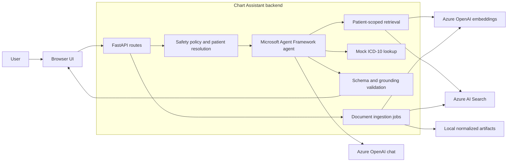
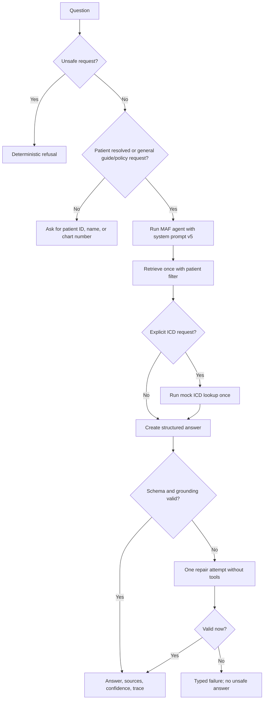

# Chart Assistant

Chart Assistant is an end-to-end RAG application for asking natural-language questions about
synthetic patient charts. It resolves the patient mentioned in a question, retrieves only allowed
chart sections, and returns a structured answer with exact source quotes.

This repository was built for the RAAPID Applied AI Engineer take-home assignment. It demonstrates
ingestion, hybrid retrieval, tool calling, schema-enforced output, grounding checks, evaluation, and
failure handling. It uses synthetic data only and is not intended for clinical, coding, billing, or
coverage decisions.

[Architecture](docs/architecture.md) · [Demo guide](docs/demo-script.md) ·
[Task 1 note](submission-files/task1.txt) · [Task 2 answers](submission-files/task2.txt)

## Highlights

- Ingests text-based PDF, DOCX, TXT, and Markdown patient charts.
- Preserves available pages, headings, dates, patient references, and source metadata.
- Uses Azure AI Search hybrid retrieval with patient and source-role filters.
- Uses Microsoft Agent Framework for bounded retrieval and mock ICD-10 tool calls.
- Returns strict Pydantic output with exact citations, confidence, and missing information.
- Rejects ambiguous patient questions before retrieval so records are never mixed.
- Validates model output in code and allows one bounded repair attempt.
- Includes five prompt iterations, 63 automated tests, and 12 deterministic retrieval evaluations.

## Why this stack

- **Microsoft Agent Framework** provides the real tool-calling loop while keeping retrieval and the
  ICD lookup as normal Python functions that can be tested independently.
- **Azure OpenAI** provides chat generation and embeddings through resources that were available for
  the assignment, which made a live end-to-end implementation practical.
- **Azure AI Search** provides keyword, vector, and semantic retrieval plus exact patient filters in
  one managed index.
- **FastAPI and Pydantic** keep the HTTP contract, structured output, and failure responses explicit.

## Architecture



The model does not receive unrestricted access to the knowledge base. Python resolves patient
context, bounds each tool, validates exact quotations, checks tool-derived codes, and fails closed
when output is unsupported.

### Answering flow



See the [architecture note](docs/architecture.md), [RAG flow](docs/flows/rag-flow.md), and
[ingestion flow](docs/flows/ingestion-flow.md) for the detailed design.

## Run locally

### Prerequisites

- Python 3.11 or newer
- Azure OpenAI chat and embedding deployments
- Azure AI Search with query and admin credentials

### Setup

```bash
python3 -m venv .venv
source .venv/bin/activate
python -m pip install --upgrade pip
python -m pip install -e '.[dev]'
cp .env.example .env
```

Add the Azure values to `.env`, then start the application:

```bash
uvicorn backend.main:app --reload
```

- Application: `http://127.0.0.1:8000`
- OpenAPI documentation: `http://127.0.0.1:8000/docs`
- Deep dependency health: `http://127.0.0.1:8000/health/services?deep=true`

Secrets stay in the ignored `.env` file. `.env.example` contains only placeholders and the clean
default index name for a new installation.

## Load the sample knowledge base

The repository contains 25 fictional documents across five synthetic patients. With the server
running, ingest them from a second terminal:

```bash
form_args=()
for source_file in data/synthetic-charts/DOC-*.txt; do
  form_args+=(--form "files=@${source_file};type=text/plain")
done
curl --fail-with-body --request POST "http://127.0.0.1:8000/ingestion" "${form_args[@]}"
```

Repeating the command is safe. Stable IDs and content hashes prevent unchanged chunks from being
embedded or indexed again.

## Suggested demo

Try these in the browser:

1. `What kidney condition is documented for patient 4?`
2. `What ICD code is supported for patient 4's documented CKD stage 3b?`
3. `Does patient 3 have diabetes, or is it family history only?`
4. `Summarize the recent visits.` — demonstrates clarification before search.

The UI clears the previous result for each question, shows a loading state, and displays the answer,
resolved patient, and source cards. Confidence, missing information, tool activity, and the technical
trace remain available under **Answer details**.

## API surface

| Method | Endpoint | Purpose |
|---|---|---|
| `POST` | `/query` | Ask a grounded patient-chart question |
| `POST` | `/ingestion` | Synchronous structured-document ingestion for CLI compatibility |
| `POST` | `/ingestion/jobs` | Upload ordinary charts and start a progress job |
| `GET` | `/ingestion/jobs/{job_id}` | Poll real ingestion stages and final results |
| `GET` | `/documents` | List locally normalized documents |
| `GET` | `/health` | Read application configuration and counts |
| `GET` | `/health/services?deep=true` | Check Azure chat, embeddings, search, and ingestion access |

## Guardrails

- **Patient isolation:** ambiguous or missing patient context stops before model and retrieval calls.
- **Evidence boundary:** evidence-bound questions must call retrieval exactly once and cannot use
  model memory as chart evidence.
- **Source authority:** clinical notes, documentation guides, and fictional policies cannot replace
  one another.
- **Exact grounding:** each citation quote must be an exact substring of its retrieved chunk.
- **Tool binding:** an ICD code can appear only when the chart-bound lookup returned that code.
- **Typed output:** extra fields, malformed output, unsupported claims, and invalid statuses fail
  validation.
- **Human review:** every response keeps `human_review_required=true`.

The final system prompt is [v5](backend/prompts/system_v5.txt). The full zero-shot to structured
prompt progression is explained in the [prompting strategy](docs/strategies/prompting.md).

## Verification

```bash
.venv/bin/python -m ruff check .
.venv/bin/python -m pytest -q
.venv/bin/python -m evals.run_evals
```

Current result: **63 tests passed** and **12/12 deterministic retrieval evaluations passed**. The
tests cover file parsing, idempotent ingestion, progress jobs, patient resolution, isolation,
retrieval filters, prompt versions, tool behavior, grounding, repairs, API errors, and evaluator
flows. Live Azure checks are kept outside CI because they require deployment credentials.

## Repository guide

```text
backend/
  api/routes/             query, ingestion, document, and health endpoints
  core/                   settings, typed errors, and structured diagnostics
  services/               ingestion, retrieval, agent, validation, tools, and Azure clients
  prompts/                five system-prompt versions and one repair prompt
frontend/                 minimal answer-first UI and static assets
data/synthetic-charts/    25 fictional notes, guides, and policies
docs/                     architecture, flows, strategies, deployment, and demo notes
evals/                    deterministic retrieval cases and runner
submission-files/         Task 1 note and Task 2 written answers
tests/                    unit, integration, API, and evaluator-style tests
api/index.py              thin Vercel ASGI adapter
```

## Deployment and limitations

GitHub Actions validates every push and pull request. A separate manual workflow creates Vercel
preview or production releases after the same quality checks. Setup and rollback instructions are in
the [Vercel release guide](docs/deployment.md).

This remains a take-home demonstration, not a PHI-ready product. Scanned PDFs require OCR, access
control and audit storage are not implemented, and the in-memory ingestion-job registry is not
durable across Vercel instances. Before real charts, I would add identity and authorization, managed
secrets, PHI-safe telemetry, durable job state, malware scanning, retention controls, and clinical
and compliance review.
