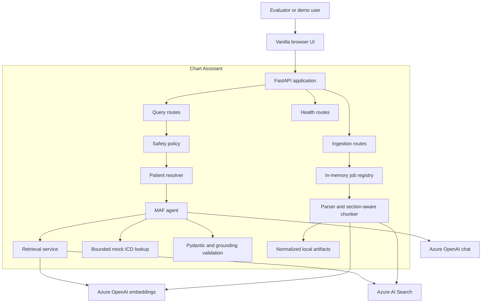
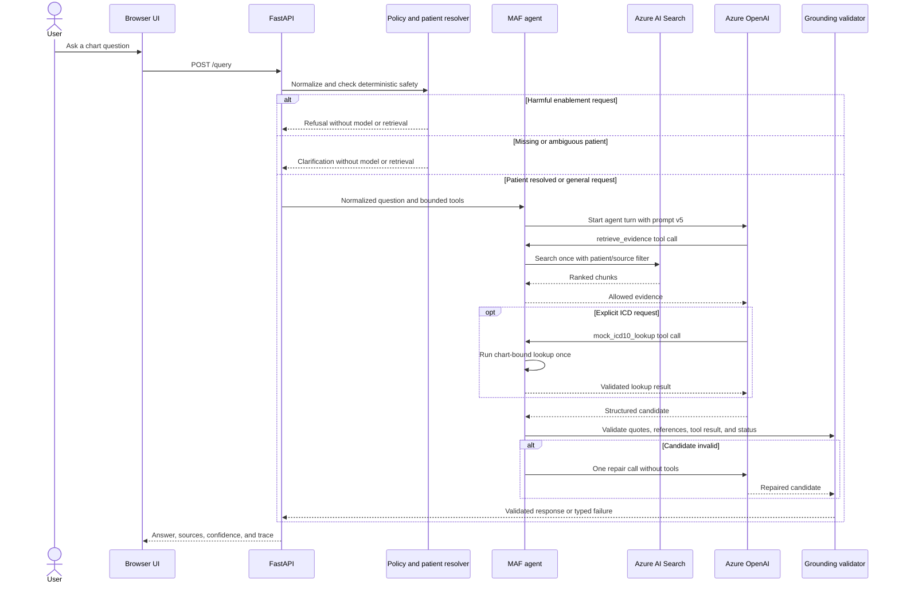
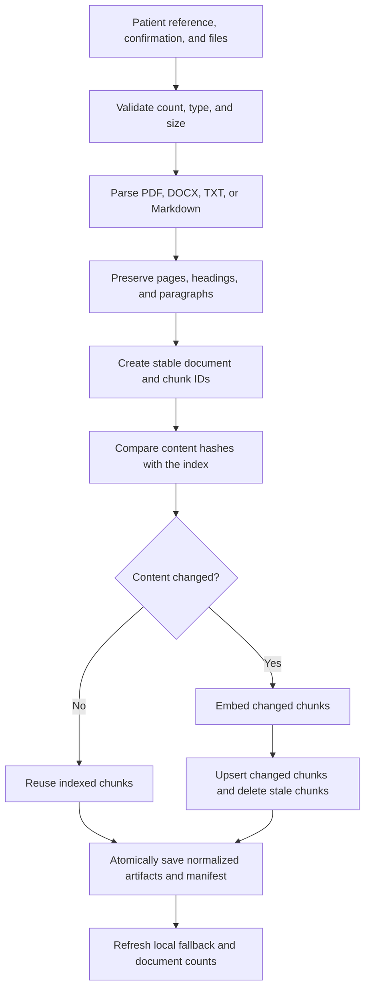

# Architecture

Chart Assistant is a small FastAPI application with a browser UI, a Microsoft Agent Framework
agent, Azure OpenAI, and Azure AI Search. The design keeps model behavior narrow: deterministic code
selects the patient, controls tools, validates grounding, and decides whether a response can be shown.

## Design goals

- Answer only from ingested synthetic documents.
- Keep patient records isolated during retrieval and validation.
- Make every factual claim traceable to an exact source quote.
- Demonstrate real tool calling without allowing the tool to prove a diagnosis.
- Surface missing information and failures instead of filling gaps from model memory.
- Keep the take-home implementation simple enough to inspect and run locally.

## System context

## Code boundaries

| Location | Responsibility |
|---|---|
| `backend/api/routes` | HTTP validation and query, ingestion, document, and health endpoints |
| `backend/core` | Environment settings, typed application errors, request IDs, and safe logs |
| `backend/services/ingestion.py` | Format parsing, normalization, chunking, hashes, and index updates |
| `backend/services/retrieval.py` | Patient/source filters, hybrid search, thresholds, and local fallbacks |
| `backend/services/agent.py` | MAF tools, prompt selection, orchestration, repair, and response assembly |
| `backend/services/grounding.py` | Exact quote, citation, code, status, and confidence checks |
| `backend/services/patients.py` | Exact ID, name, chart-number, and shortcut resolution |
| `backend/models.py` | Strict request, response, evidence, ingestion, and trace schemas |
| `frontend` | Answer-first UI, system health, upload progress, and result details |

Route modules depend on services through `backend/api/dependencies.py`. Services do not depend on
the browser or route layer, which keeps retrieval and grounding independently testable.

## Query sequence

## Ingestion sequence

The UI sends files to `POST /ingestion/jobs`, shows browser upload progress, and polls the job status
for real processing stages. Raw upload bytes are released after processing. The synchronous
`POST /ingestion` endpoint remains for the structured sample dataset and CLI compatibility.

## Data and state

| State | Location | Purpose | Durability |
|---|---|---|---|
| Search chunks and vectors | Azure AI Search | Primary shared knowledge base | Durable |
| Normalized text, chunk JSONL, manifest | `.artifacts/ingestion` | Local fallback, counts, and idempotency | Local and ignored by Git |
| Upload job status | Process memory | Demo progress polling | Not durable across instances |
| Prompt versions | `backend/prompts` | Reproducible agent behavior | Version controlled |
| Request trace | API response and structured logs | Debugging without chart content in logs | Per request |

## Retrieval and fallback

The primary path embeds the normalized question, applies an exact patient/source filter in Azure AI
Search, and uses hybrid keyword/vector retrieval with semantic reranking. Returned chunks are checked
again for allowed patient, source role, lexical support, threshold, and context budget.

If hosted search fails and local artifacts are present, the service reports the warning and can use
the in-memory hybrid fallback. BM25 remains the final local fallback. A fallback is visible in the
response trace and reduces confidence; it is never silent.

## Guardrails and failure behavior

| Risk | Control |
|---|---|
| Cross-patient retrieval | Resolve one patient before search; apply and recheck patient filters |
| Prompt injection in documents | Treat retrieved text as untrusted data; tools remain code-bounded |
| Unsupported claim | Exact quote and chunk-reference validation |
| Incorrect source authority | Separate clinical notes, guides, and fictional policies |
| Unsupported ICD code | Require a matched lookup tied to a retrieved clinical chunk |
| Malformed model output | Strict Pydantic schema and one repair attempt |
| Provider or search failure | Typed retryable errors, health endpoints, and visible fallback warnings |
| Harmful request | Deterministic pre-model refusal |

Every response requires human review. The confidence score describes workflow support, not clinical
truth or model certainty.

## Observability

Every request receives an `X-Request-ID`. Structured logs record stages, status, latency, token
usage, retrieval counts, backend choice, and safe provider request identifiers. They do not record
credentials, vectors, raw chart text, or the user's question. Deep health endpoints separately test
chat, embeddings, search query access, and search administration access.

## Production boundary

The current system is suitable for a synthetic-data demonstration. A real deployment would need
authentication and patient-level authorization, durable job state and queues, malware and OCR
processing, encrypted storage, PHI-safe audit logs, retention/deletion controls, rate limiting,
private networking, monitored evaluation, and clinical/compliance approval.

## More detail

- [User flow](flows/user-flow.md)
- [Ingestion flow](flows/ingestion-flow.md)
- [RAG flow](flows/rag-flow.md)
- [Prompting strategy](strategies/prompting.txt)
- [Chunking strategy](strategies/chunking.txt)
- [Release guide](deployment.md)
