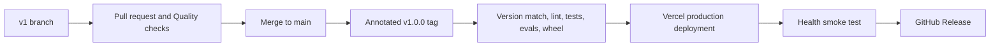

# Release and Vercel deployment guide

Chart Assistant uses semantic application versions. The first public release is `1.0.0`, and its
Git tag is `v1.0.0`. The application version has one source of truth in `backend/__init__.py` and is
also exposed by the FastAPI schema, `/health`, and answer traces.

Other version labels have their own meaning and should not be kept in sync with the app release:

- `v1` is the working branch and pull-request name.
- `v5` is the selected prompt revision.
- `healthchat-documents-v1` is the search-index schema generation.
- Azure API dates and structured-document schema versions belong to those external contracts.

## Release flow



- **Quality** runs once for pull requests and again for changes merged into `main`.
- **Preview on Vercel** is manual and deploys the selected branch to the `preview` environment.
- **Release to Vercel** runs only for tags shaped like `v1.0.0`. It refuses to deploy when the tag
  and the version in the code do not match or the tagged commit is not already on `main`.

## One-time setup

1. Import the GitHub repository into Vercel and leave the project root as `.`.
2. Add the variables from `.env.example` to the Vercel Preview and Production environments. Keep
   real Azure keys in Vercel, never in Git.
3. Add these GitHub repository secrets: `VERCEL_TOKEN`, `VERCEL_ORG_ID`, and `VERCEL_PROJECT_ID`.
4. Create GitHub environments named `preview` and `production`. A required reviewer on production
   adds a final approval before deployment.

## Create a preview

Open **Actions → Preview on Vercel → Run workflow** and select the branch. The job runs the full
verification suite, deploys one prebuilt artifact, checks the app and its live Azure dependencies,
and writes the URL to the job summary.

## Publish v1.0.0

Merge the pull request first. Then create the release tag from the updated `main` branch:

```bash
git switch main
git pull --ff-only
git tag -a v1.0.0 -m "Chart Assistant v1.0.0"
git push origin v1.0.0
```

The tag starts the production workflow. It validates that `v1.0.0` matches application version
`1.0.0`, confirms the commit is on `main`, repeats all checks, deploys to Vercel, verifies the app
and its live Azure dependencies, and creates the GitHub Release with generated notes. Do not create
the tag before the pull request is merged.

For the next release, update `backend/__init__.py` and `CHANGELOG.md` in the release pull request,
then use the matching tag such as `v1.0.1` or `v1.1.0`.

## Rollback

Vercel keeps immutable deployments. Promote the previous healthy deployment from the Vercel
dashboard or run `vercel rollback`. Keep the GitHub Release and tag in place as history; ship a new
patch version for the code fix.

## Demo limitation

The answering flow fits Vercel's Python runtime. Chart-upload jobs currently use an in-memory
registry and local temporary files, so they are suitable for this take-home demo but not durable
production ingestion. A real deployment should move job state to durable storage and processing to
a queue or workflow while keeping Azure AI Search as the shared knowledge base.
