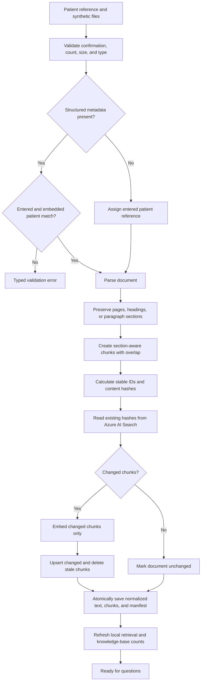

# Ingestion flow

The browser uses `POST /ingestion/jobs` and polls `GET /ingestion/jobs/{job_id}`. Reported stages
are queued, validating, parsing, chunking, checking changes, embedding, updating the index, saving,
completed, or failed. The synchronous `POST /ingestion` endpoint remains available for structured
sample documents and command-line use.

Generic-chart IDs come from the normalized patient reference and filename; structured sample files
retain their embedded document IDs. Stable chunk hashes make repeat uploads idempotent. Raw uploaded
bytes and vectors are not persisted locally. Text-based PDFs are supported; encrypted and image-only
PDFs return a clear OCR-not-supported error.
