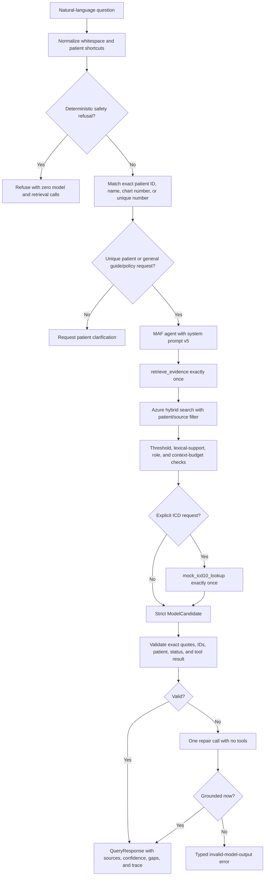

# RAG flow

Patient resolution happens before the agent or search. Canonical references such as `SYN-P004`,
shortcuts such as “patient 4,” exact stored names, and unique numeric identifiers are supported.
Fuzzy guessing is not used. General guide or policy questions may search the matching source role
without a patient.

No matching evidence is a valid outcome. The assistant returns partial or refused with missing
information instead of answering from model memory. Azure filters are checked again after retrieval,
and fallback backend use is recorded in the response trace.
