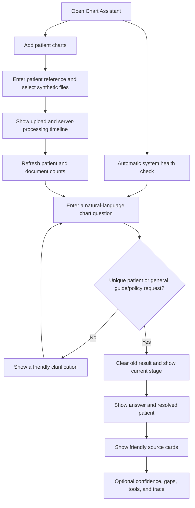

# User flow

Question requests carry a request identity in the browser. Cancelling or starting another question
prevents an older response from replacing the current result. Missing, unknown, or ambiguous patient
context stops before retrieval and model calls.

The upload form accepts PDF, DOCX, TXT, and Markdown. It shows selected files, removal controls,
actual browser upload progress, server processing stages, elapsed time, and safe retryable errors.
